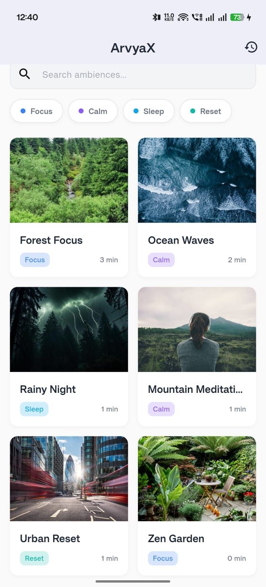
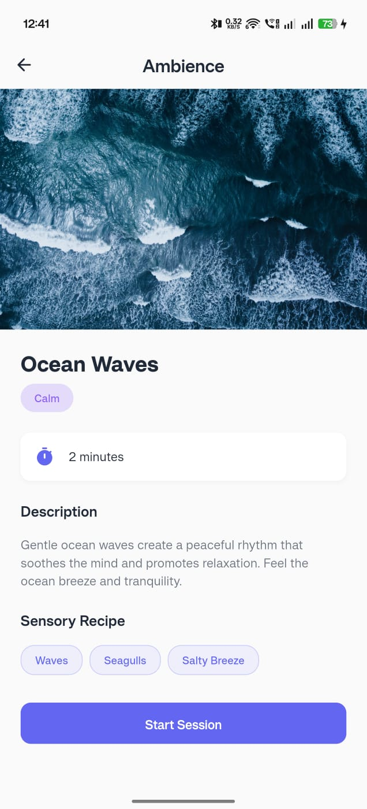
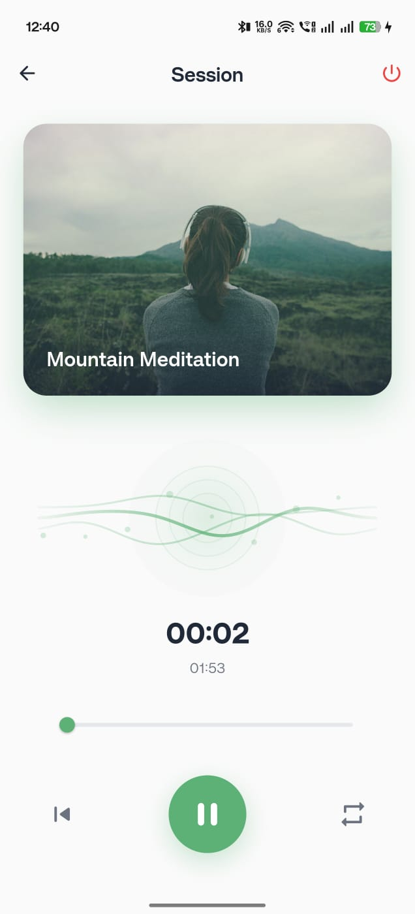
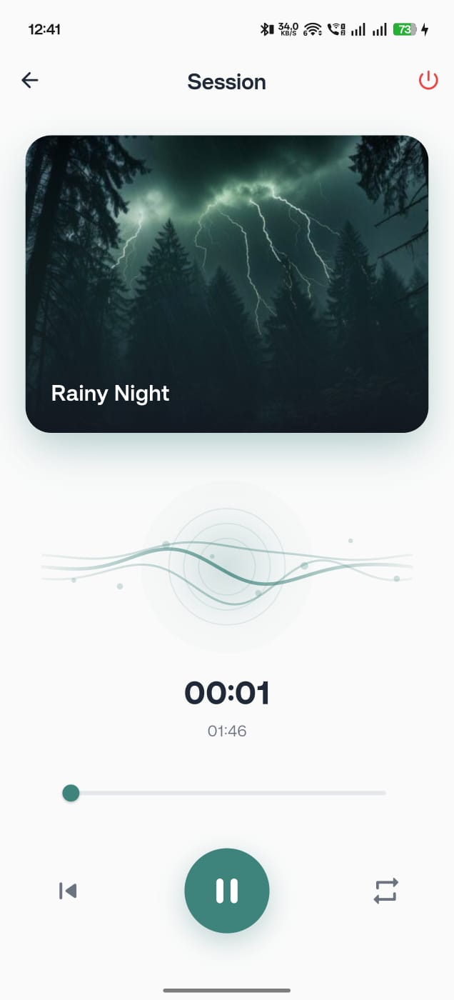
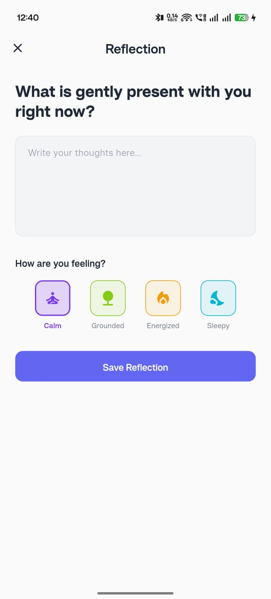
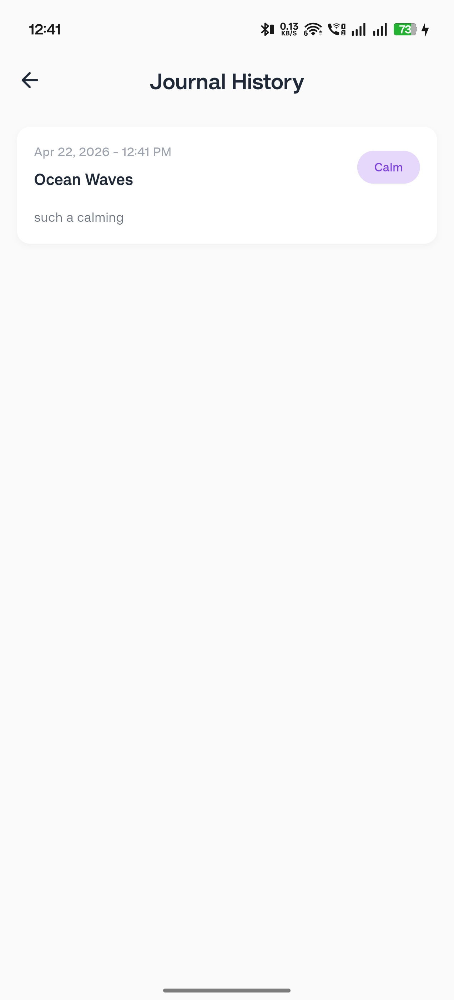
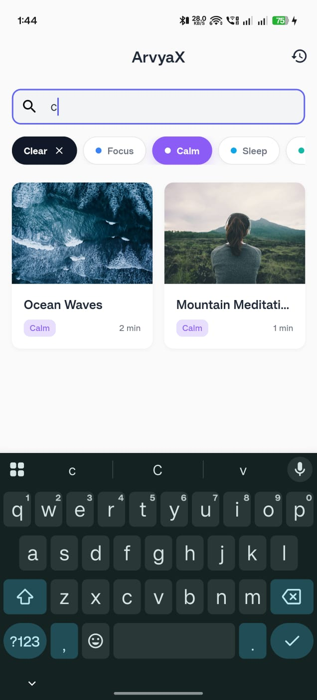
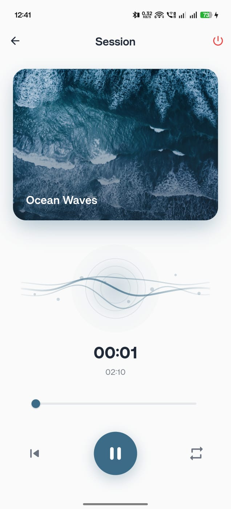

# ArvyaX

ArvyaX is a Flutter mindfulness ambience app. It lets users browse calming ambience sessions, play audio with a focused session player, loop or pause playback, continue playback while the screen is locked, and write a reflection after a session ends. Journal entries are stored locally and can be viewed later from the history screen.

## Demo And Download

- [Demo video](https://drive.google.com/file/d/1hLs4cFtzUQ654kE8i6HmVHQMBbNGhi7c/view?usp=drivesdk)
- [APK download](https://drive.google.com/file/d/1QEhI4L54t_wo_GGoDum5-9wZQDskxjJr/view?usp=drivesdk)

## Screenshots

| Home | Ambience Details | Session Player |
| --- | --- | --- |
|  |  |  |

| Reflection | Journal History | Journal Detail |
| --- | --- | --- |
|  |  |  |

| Extra Screen | Extra Screen |
| --- | --- |
|  |  |

## How To Run

1. Install Flutter and make sure the SDK is available:

   ```bash
   flutter doctor
   ```

2. Install project dependencies:

   ```bash
   flutter pub get
   ```

3. Generate model/adaptor files if needed:

   ```bash
   dart run build_runner build --delete-conflicting-outputs
   ```

4. Run the app:

   ```bash
   flutter run
   ```

The project includes local assets under `assets/images`, `assets/audio`, and `assets/data/ambiences.json`. These are already registered in `pubspec.yaml`.

## Architecture

The app follows a feature-first Flutter architecture with a small data layer, BLoC state management, and reusable shared UI components.

```text
lib/
  config/
    router.dart              App routes using go_router
    service_locator.dart     Dependency injection using get_it

  core/
    constants/               Shared spacing and constants
    theme/                   Colors, text styles, icons, app theme, decorations

  data/
    datasources/             Local JSON and Hive access
    models/                  Freezed/Hive/JSON models
    repositories/            Data access abstractions used by BLoCs

  features/
    ambience/
      bloc/                  Ambience loading and filtering state
      presentation/screens/  Home and ambience detail screens
    player/
      bloc/                  Audio playback and session state
      presentation/screens/  Main session player screen
    journal/
      bloc/                  Journal save/load/delete state
      presentation/screens/  Reflection, history, and detail screens

  shared/
    components/              Reusable widgets such as cards, mini player,
                             empty state, mood selector, dialogs, and wave UI
```

## State Management Approach

The app uses `flutter_bloc`.

Each major feature owns its state through a BLoC:

- `AmbienceBloc` loads ambience data from the repository and filters it by search text or tag.
- `PlayerBloc` owns the active audio session, play/pause/seek/loop behavior, session completion, and local session persistence.
- `JournalBloc` saves reflections, loads journal history, opens entry details, and deletes entries.

UI widgets dispatch events such as `LoadAmbiences`, `StartSession`, `PauseAudio`, `ToggleLoop`, or `SaveJournalEntry`. BLoCs respond by calling repositories, updating internal state, and emitting UI states such as loading, loaded, active, paused, saved, or error.

## Data Flow

The data flow is intentionally one-way:

```text
Data source -> Repository -> BLoC/controller -> UI
UI event    -> BLoC/controller -> Repository -> Data source
```

Example: loading ambiences

1. `AmbienceHomeScreen` dispatches `LoadAmbiences`.
2. `AmbienceBloc` receives the event.
3. `AmbienceBloc` calls `AmbienceRepository.getAmbiences()`.
4. The repository calls `AmbienceLocalDataSource.getAmbiences()`.
5. The local data source reads `assets/data/ambiences.json`.
6. JSON is converted into `Ambience` models.
7. `AmbienceBloc` emits `AmbienceLoaded`.
8. The UI rebuilds the ambience grid.

Example: playing a session

1. `AmbienceDetailsScreen` dispatches `StartSession(ambience)`.
2. `PlayerBloc` creates a `SessionState`, stores it through `SessionRepository`, configures the audio session, loads the audio asset with `just_audio`, and starts playback.
3. `PlayerScreen` listens to `PlayerActive` or `PlayerPaused`.
4. The UI renders the artwork, dynamic image-colored glow, controls, timer, loop state, and animated wave.
5. When the session ends, `PlayerBloc` emits `SessionEnded`, clears the stored session, and the UI navigates to reflection.

Example: saving a journal entry

1. `JournalReflectionScreen` dispatches `SaveJournalEntry`.
2. `JournalBloc` calls `JournalRepository.saveEntry()`.
3. The repository writes to Hive through `JournalLocalDataSource`.
4. `JournalBloc` emits `JournalSaved`, then reloads the journal list.
5. The UI navigates to journal history.

## Packages Used

- `flutter_bloc`: Feature state management with clear events and states.
- `equatable`: Value comparison for BLoC events/states without manual equality code.
- `go_router`: Declarative navigation for home, details, player, reflection, history, and detail routes.
- `get_it`: Lightweight dependency injection for data sources, repositories, and BLoCs.
- `hive` and `hive_flutter`: Fast local storage for session state and journal entries.
- `just_audio`: Reliable local audio asset playback, seeking, pause/resume, and loop mode.
- `audio_session`: Configures the platform audio session so playback can continue appropriately when the device is locked.
- `freezed_annotation`, `freezed`: Immutable model classes with generated copy/equality helpers.
- `json_annotation`, `json_serializable`: JSON serialization for ambience, session, and journal models.
- `hive_generator`: Generates Hive adapters for local persistence.
- `uuid`: Creates unique IDs for sessions and journal entries.
- `intl`: Formats journal dates in a readable way.
- `flutter_animate`: Included for animation support and future UI polish.
- `cupertino_icons`: Default iOS-style icon font support.
- `flutter_lints`: Static analysis rules to keep code consistent.
- `build_runner`: Runs code generation for Freezed, JSON, and Hive.

## Tradeoffs

The current implementation favors simplicity and local-first behavior. Ambiences are bundled in a JSON file, audio/images are local assets, and journal entries are stored on-device with Hive. This makes the app fast, offline-friendly, and easy to run without a backend.

The tradeoff is that content updates require an app update or asset replacement. There is also no cloud sync, account system, or remote analytics. Audio playback uses local assets and app-managed session timing, which is simple and predictable, but a production meditation app may eventually need richer background controls and media notifications.

## What I Would Improve With Two More Days

- Add full background audio media controls and lock-screen metadata using an audio service layer.
- Add automated widget tests for session ending, journal save flow, filtering, and navigation fallbacks.
- Add repository-level tests around Hive persistence and JSON ambience loading.
- Polish accessibility: semantic labels for controls, larger tap targets where needed, and better screen reader text.
- Add a richer content model with categories, favorites, recently played sessions, and recommended ambiences.
- Improve session restoration after app restart by rehydrating audio position and active ambience more completely.
- Replace remaining deprecated `withOpacity` usages with `withValues` across the theme/widgets.
- Add screenshots or a short demo GIF to the README for easier review.
